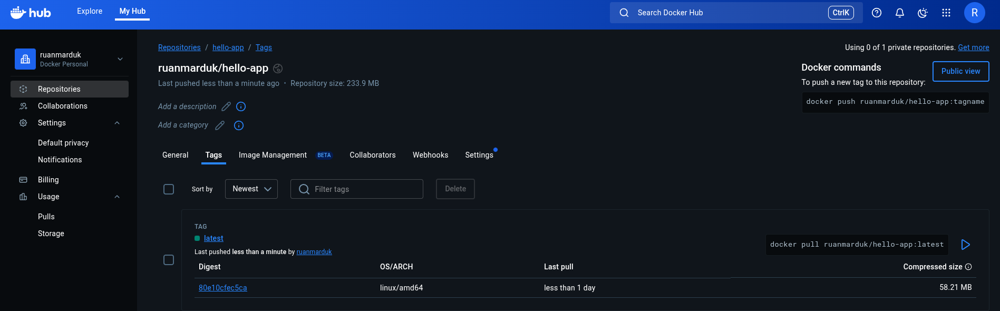
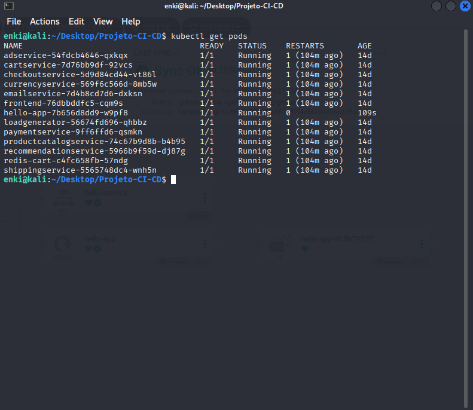
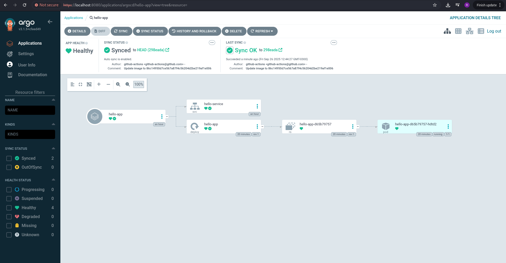
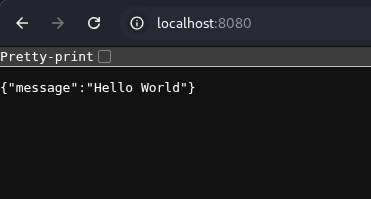

Projeto CI/CD com Docker, GitHub Actions, Kubernetes e ArgoCD

 Visão Geral e Conceitos  
Este repositório documenta a criação de um pipeline completo de Integração Contínua (CI) e Entrega Contínua (CD), que são pilares fundamentais da metodologia DevOps. O objetivo é automatizar o ciclo de desenvolvimento de uma aplicação FastAPI desde o código até a produção.

**Docker**: É a tecnologia de containerização que empacota nossa aplicação e todas as suas dependências em um ambiente isolado e portátil, garantindo que ela rode de forma consistente em qualquer lugar.  

**GitHub Actions**: É a plataforma de automação do GitHub que executa workflows (sequências de tarefas) em resposta a eventos no repositório, como um git push. Ele será o nosso motor de CI.  

**Docker Hub**: É um serviço de registro de imagens Docker, onde armazenamos e gerenciamos as imagens prontas da nossa aplicação, prontas para serem baixadas e executadas.  

**Kubernetes**: É uma plataforma de orquestração de containers que gerencia o ciclo de vida das nossas aplicações em ambientes de cluster. Ele garante a alta disponibilidade e escalabilidade.  

**ArgoCD**: É uma ferramenta de GitOps para o Kubernetes. Ele atua como o nosso motor de CD, monitorando nosso repositório Git e aplicando automaticamente qualquer alteração nos manifestos de deploy ao cluster.  

---

 Estrutura do Projeto  

A estrutura de pastas foi organizada para separar claramente o código da aplicação dos arquivos de infraestrutura.


```text
Projeto-CI-CD/
├── app/                          # Código da aplicação (FastAPI) e suas dependências
│   ├── main.py
│   └── requirements.txt
│
├── hello-manifests/              # Manifests do Kubernetes
│   ├── deployment.yaml
│   └── service.yaml
│
├── .github/
│   └── workflows/                # Workflow do GitHub Actions
│       └── ci-cd.yml
│
├── Dockerfile                    # Instruções para construir a imagem Docker
└── README.md                     # Documentação do projeto
```

---

 **Docker**

### Criar a imagem localmente
Para testar o build do container sem usar o GitHub Actions, execute:

```bash
docker build -t seu-usuario-dockerhub/hello-app:latest .
```

A flag `-t` (tag) nomeia a imagem. A tag `seu-usuario-dockerhub/hello-app:latest` é usada para identificar a imagem no seu repositório local e futuro envio para o Docker Hub.

### Rodar localmente
```bash
docker run -p 5000:5000 seu-usuario-dockerhub/hello-app:latest
```

A flag `-p` mapeia a porta 5000 da sua máquina para a porta 5000 do container.

---


* **Tagging e Push da Imagem:** A imagem é agora construída com a tag do `commit SHA` e uma tag adicional **`latest`**. Ambas são enviadas ao Docker Hub para garantir que o ArgoCD sempre encontre a versão mais atual.



 **GitHub Actions**

O arquivo `ci-cd.yml` define a lógica do nosso pipeline de CI/CD.

Arquivo: `.github/workflows/ci-cd.yml`

```yaml
name: CI/CD Pipeline

on:
  push:
    branches: ["main"]

jobs:
  build:
    runs-on: ubuntu-latest

    steps:
      - name: Checkout repository
        uses: actions/checkout@v3

      - name: Log in to Docker Hub
        uses: docker/login-action@v2
        with:
          username: ${{ secrets.DOCKER_USERNAME }}
          password: ${{ secrets.DOCKER_PASSWORD }}

      - name: Build and push Docker image
        run: |
          IMAGE=docker.io/ruanmarduk/hello-app
          TAG=${{ github.sha }}
          docker build -t $IMAGE:$TAG .
          docker tag $IMAGE:$TAG $IMAGE:latest
          docker push $IMAGE:$TAG
          docker push $IMAGE:latest

      - name: Update deployment.yaml with new image
        run: |
          cd hello-manifests
          git pull origin main
          sed -i "s|image: .*|image: docker.io/ruanmarduk/hello-app:${{ github.sha }}|" deployment.yaml
          git config user.name github-actions
          git config user.email github-actions@github.com
          git add deployment.yaml
          git commit -m "Update image to ${{ github.sha }}"
          git push
```

Secrets necessários no GitHub → `Settings > Secrets and variables > Actions`:

- `DOCKER_USERNAME` → Seu usuário do Docker Hub  
- `DOCKER_PASSWORD` → Token de acesso do Docker Hub  

---

 **Kubernetes**

### deployment.yaml
```yaml
apiVersion: apps/v1
kind: Deployment
metadata:
  name: hello-app
spec:
  replicas: 2
  selector:
    matchLabels:
      app: hello-app
  template:
    metadata:
      labels:
        app: hello-app
    spec:
      containers:
      - name: hello-app
        image: docker.io/ruanmarduk/hello-app:latest
        ports:
        - containerPort: 5000
      imagePullSecrets:
      - name: regcred
```

### service.yaml
```yaml
apiVersion: v1
kind: Service
metadata:
  name: hello-service
spec:
  selector:
    app: hello-app
  ports:
    - protocol: TCP
      port: 80
      targetPort: 5000
  type: LoadBalancer
```

---

 **ArgoCD**

Instalação:
```bash
kubectl create namespace argocd
kubectl apply -n argocd -f https://raw.githubusercontent.com/argoproj/argo-cd/stable/manifests/install.yaml
```

Acesso à UI:
```bash
kubectl port-forward svc/argocd-server -n argocd 8080:443
```
Abrir no navegador: https://localhost:8080  

Usuário: `admin`  
Senha inicial:
```bash
kubectl -n argocd get secret argocd-secret -o jsonpath="{.data.admin\.password}" | base64 -d
```

---

 **Verificação e Conclusão**

**Status no Kubernetes**: O comando `kubectl get pods` mostra que o pod da aplicação está em estado **`Running`**.



1. **ArgoCD** exibe `hello-app` como `Synced` e `Healthy`.
   
   
2. `kubectl get pods` mostra os pods rodando.
   
3. A aplicação pode ser acessada em `http://localhost:8080` exibindo:
   

```json
{"message":"Hello World"}
```

---

Esse pipeline automatiza **todo o ciclo de vida da aplicação**, do commit no GitHub até o deploy no Kubernetes com ArgoCD.
```
